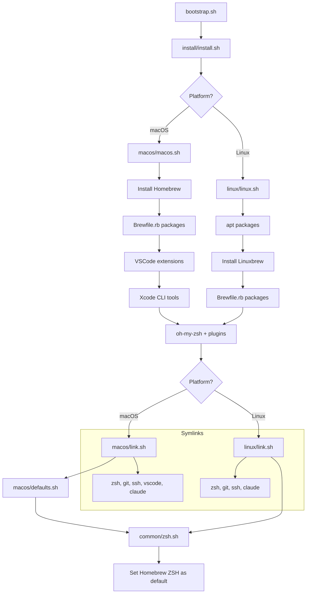

# dotfiles

Personal dotfiles for managing development environment configuration across macOS and Linux systems.

## Features

- **ZSH configuration** with oh-my-zsh, custom theme, and plugins
- **Git configuration** with fail-loud identity routing for personal/work contexts
- **SSH configuration** with 1Password integration and pinned per-context keys
- **VS Code settings** and keybindings
- **Homebrew packages** managed via Brewfiles
- **Custom utilities** and shell functions
- **CLAUDE.md template system** for Claude Code projects

## Quick Start (Fresh Mac)

1. **Install Xcode Command Line Tools** (required for `git`):

   ```bash
   xcode-select --install
   ```

   A dialog will appear — click **Install** and wait for it to finish.

2. **Clone the repo** (use HTTPS since SSH keys won't exist yet):

   ```bash
   git clone https://github.com/taloncjones/dotfiles.git ~/Git/personal/dotfiles
   ```

3. **Run bootstrap:**

   ```bash
   cd ~/Git/personal/dotfiles
   ./bootstrap.sh
   ```

4. **Set up work identity** (writes machine-local files not tracked in the repo):

   ```bash
   identity-setup
   ```

   This wizard writes `~/.gitconfig-work`, `~/.ssh/id_ed25519_work.pub`, and
   `~/.ssh/config_local`. Skip if you only use the personal identity.

5. **No remote switch needed:** once the 1Password SSH agent is configured,
   pushes route over SSH automatically — `url.insteadOf`/`pushInsteadOf` in
   the identity includes rewrite `github.com` remotes to the pinned SSH
   aliases, so the HTTPS clone URL is fine to keep.

> **Note:** You can clone the repo to any directory — the install scripts dynamically resolve paths, so symlinks will work regardless of location.

### What bootstrap does

The install script will:

1. Install Homebrew (if not already installed)
2. Install all packages from Brewfiles
3. Install oh-my-zsh and plugins
4. Create symbolic links to configuration files
5. Seed machine-local identity files from templates (first install only)
6. Set macOS defaults (macOS only)

#### Install Flow



### Post-Installation Steps

#### 1. 1Password CLI Integration (Optional)

To enable 1Password shell plugin integration:

1. Open 1Password app
2. Go to Settings → Developer
3. Enable "Use the SSH agent"
4. Enable "Integrate with 1Password CLI"

This will create `~/.config/op/plugins.sh` which is automatically sourced by `.zshrc`.

#### 2. Reload Shell

```bash
exec zsh
```

Or log out and log back in to activate Homebrew ZSH.

#### 3. Verify Installation

```bash
# Check which ZSH is running
which zsh
# Should show: /opt/homebrew/bin/zsh (macOS ARM) or /usr/local/bin/zsh (macOS Intel)

# Check dotfiles environment variable
echo $DOTFILEDIR
# Should show the path to this repository

# Verify identity chain
identity-doctor
```

## Directory Structure

```
dotfiles/
├── install/          # Installation scripts
│   ├── common/       # Platform-agnostic (Brewfile, ZSH setup, shared linking)
│   ├── macos/        # macOS-specific (apps, defaults, linking)
│   └── linux/        # Linux-specific (packages, linking)
├── zsh/              # ZSH configuration
│   ├── .zshrc        # Main ZSH config
│   ├── .zprofile     # ZSH profile
│   ├── aliases.zsh   # Shell aliases
│   ├── functions.zsh # Shell functions (includes claude() account wrapper)
│   ├── scripts/      # Modular utility scripts
│   └── theme.zsh     # Custom theme
├── git/              # Git configuration
│   ├── .gitconfig    # Main config; no [user] block (useConfigOnly + includeIf routing)
│   ├── hooks/        # Global git hooks (symlinked to ~/.config/git/hooks)
│   │   └── post-checkout  # Hydrates .todos/ and .planning/ into new worktrees
│   ├── personal/     # Personal git identity (tracked)
│   │   └── .gitconfig-personal
│   └── work/         # Work git identity template (machine-local; never tracked)
│       └── .gitconfig-work.tmpl
├── vscode/           # VS Code settings and extensions
├── ssh/              # SSH configuration
│   ├── configs/      # SSH config files (main config + personal/work includes)
│   │   └── agent.toml  # 1Password agent template (seeded machine-local on install)
│   └── keys/         # Personal public key only (work key is machine-local)
│       └── id_ed25519_personal.pub
├── ghostty/          # Ghostty terminal config
├── bin/              # Custom utility scripts
│   ├── dotfiles-repair  # Bring an older machine back to a known-good state
│   ├── identity-doctor  # Verify the full identity chain (also: git identity)
│   ├── identity-setup   # Interactive wizard to write machine-local work identity
│   └── setup-claude     # Add CLAUDE.md/.claude to .git/info/exclude in any repo
├── claude/           # Claude Code configuration
│   ├── CLAUDE.md           # Global instructions
│   ├── settings.json.tmpl  # Settings template (seeded to ~/.claude/settings.json on first install)
│   ├── commands/           # Custom slash commands
│   ├── agents/             # Custom agents
│   └── hooks/              # Pre/post tool hooks
├── codex/            # Codex (OpenAI CLI) configuration
│   ├── AGENTS.md     # Codex project memory
│   └── hooks/        # Codex PreToolUse hooks
├── LICENSE           # MIT license
└── NOTICE            # Third-party attributions
```

## Key Commands

### Dotfiles Management

```bash
# Navigate to dotfiles directory
dotfiles

# Update dotfiles and dependencies
update

# Reload ZSH configuration
reload
```

### Shell Utilities

```bash
# List all available aliases
aliaslist

# List all available functions
functionlist

# Extract any compressed archive
extract file.tar.gz

# Show file/directory size
fs ~/Documents

# Show file permissions
permissions file.txt
```

### Claude Code Project Setup

```bash
# In any git repo: add CLAUDE.md and .claude/ to .git/info/exclude
setup-claude
```

This keeps Claude configuration local to your machine without polluting the repo's `.gitignore`.

### Identity Routing

Git and SSH identity is split between a tracked personal config and machine-local work config. Neither employer names nor work keys are stored in the repo.

**How it works:**

- `~/.gitconfig` has no `[user]` block. `user.useConfigOnly = true` makes git refuse to commit (with a clear error) in any repo outside `~/Git/personal` and `~/Git/work` rather than silently guessing.
- `includeIf "gitdir/i:~/Git/personal/"` loads `~/.gitconfig-personal` (tracked). `includeIf "gitdir/i:~/Git/work/"` loads `~/.gitconfig-work` (machine-local, seeded from `git/work/.gitconfig-work.tmpl`).
- `url.insteadOf` in each include rewrites `git@github.com:` remotes to the correct SSH alias (`Git-Personal` or `Git-work`) automatically — no manual `update-remote` needed.
- SSH: `~/.ssh/config` includes `~/.ssh/config_local` (machine-local hosts) first, then `config_personal` and `config_work`. The personal key is pinned for `github.com` and `Git-Personal`. The work key (`~/.ssh/id_ed25519_work.pub`) is machine-local and pinned via `config_work`.
- 1Password agent config (`~/.config/1Password/ssh/agent.toml`) is seeded from `ssh/configs/agent.toml` on first install — real vault/item names stay off the repo.
- The `claude()` ZSH wrapper selects `~/.claude-work` when launching under `~/Git/work`, `~/.claude` otherwise. `claude-account` shows the active routing.

**Setting up work identity on a new machine:**

```bash
identity-setup   # writes ~/.gitconfig-work, ~/.ssh/id_ed25519_work.pub, ~/.ssh/config_local
identity-doctor  # verify the full chain (also available as: git identity)
```

### Worktree Hydration

`git`'s `core.hooksPath` (set in `.gitconfig`) points at `~/.config/git/hooks`, which is symlinked to `git/hooks/` in this repo. The `post-checkout` hook fires on `git worktree add` and hydrates untracked directories into the new worktree:

- **`.todos/`** — whole-directory symlink to the main worktree (no per-branch state).
- **`.planning/`** — if present in the main worktree, applies the maintenance/workspace partition (symlinks for shared records, per-worktree copies for execution state). See the hook source for details.

The hook is a no-op in repos that have neither `.todos/` nor `.planning/` in the main worktree.

### Claude Code Configuration

The `claude/` directory is symlinked to `~/.claude/` and `~/.claude-work/` and provides:

**Commands** (`/command`):

- `/arch-review` - Architecture review
- `/arewedone` - Structural completeness check
- `/bugs` - Systematic bug hunting
- `/checks` - View CI status
- `/commit` - Create a commit with auto-detected scope
- `/dev-review` - Comprehensive development review
- `/doc` - Generate or review documentation
- `/done` - Finish work and clean up
- `/explain` - Deep dive explanation
- `/handoff` - Save a next-slice kickoff brief to `.claude/handoffs/`
- `/jira` - Interact with linked Jira ticket
- `/kickoff` - Resume the next slice from the saved handoff
- `/lint` - Run linters and formatters
- `/pr` - Create a pull request
- `/ready` - Verify and finalize for review
- `/rebase` - Smart git rebase
- `/refresh` - Refresh codebase context
- `/start` - Start new work
- `/status` - Check current work status
- `/switch` - Switch between worktrees
- `/test` - Run project tests
- `/worktree` - Git worktree management

**Agents** (subagent definitions):

- `architecture-reviewer` - Design pattern review
- `bug-finder` - Code audit for logical errors
- `completeness-reviewer` - Verify structural integrity
- `doc-implementer` - Write/update documentation
- `doc-reviewer` - Documentation quality audit

**Skills** (`claude/skills/`, loaded on demand by trigger phrases):

- `brief`, `todos`, `weekly` - daily/weekly planning built on the `.todos/` backlog
- `co-review`, `codex-spec-review`, `codex-plan-review` - dual-model (Claude + Codex) review gates
- `ship`, `post-merge`, `reconcile`, `wrap` - delivery, teardown, Jira drift repair, session exit
- `lib/work-state.sh` - shared PR/worktree state gathering (tested by `lib/test_work_state.sh`)

**Hooks** (pre/post tool execution):

- `account_guard.py` - Warn at session start when Claude account does not match directory convention
- `block_secrets.py` - Block reads/writes of files containing secrets
- `cache_jira_url.py` - Cache the linked Jira instance URL after MCP calls
- `commit_guard.py` - Enforce commit message standards (no attribution, no emojis)
- `emoji_guard.py` - Block emojis in edited files
- `format_files.py` - Auto-format edited files with prettier
- `no_ai_attribution_bash.py` - Block AI attribution phrases in shell command bodies
- `no_ai_comments.py` - Block tool-generated comments in code
- `protect_claude_md.py` - Warn before editing global CLAUDE.md

## Configuration

### Python Environment Management

This dotfiles setup uses **uv** (not pyenv) for Python management:

```bash
# Create a virtual environment
uv venv

# Install packages
uv pip install requests

# Run a script with dependencies
uv run script.py

# Manage Python versions
uv python install 3.12
uv python pin 3.12
```

### Git Contexts

Git identity is fail-loud by design: committing outside `~/Git/personal` or
`~/Git/work` produces an error rather than silently using a wrong identity.

- `~/Git/personal/*` — personal email and signing key (from `~/.gitconfig-personal`)
- `~/Git/work/*` — work email and signing key (from `~/.gitconfig-work`, machine-local)

To customize personal identity edit `git/personal/.gitconfig-personal`. To customize
work identity run `identity-setup` or edit `~/.gitconfig-work` directly.

### Global Git Hooks

`.gitconfig` sets `core.hooksPath` to `~/.config/git/hooks`, which the installer
symlinks to `git/hooks/` in this repo. The hook is a no-op for repos that do not
use `.todos/` or `.planning/`, so it is safe to leave globally enabled.

**`post-checkout`** — runs after `git worktree add` (and other branch checkouts).
Hydrates untracked worktree directories from the main checkout:

- **`.todos/`** — symlinked to the main worktree in maintenance mode (whole-directory;
  no per-branch state). Skipped in workspace mode.
- **`.planning/`** — if present in the main worktree, applies a maintenance/workspace
  partition. In maintenance mode: `codebase/`, `quick/`, `todos/`, `ROADMAP.md`, and
  `TODO.md` are symlinked to main; `STATE.md` and `config.json` are copied (per-branch
  isolation). In workspace mode the hook skips entirely and the worktree owns its
  `.planning/`.

Environment flags: `GSD_HOOK_REPAIR=1` (maintenance: replace wrong-shape paths with
canonical symlinks) and `GSD_HOOK_ISOLATE=1` (workspace: convert leftover maintenance
symlinks to per-worktree copies).

### Adding New Packages

**CLI tools (all platforms):**

```bash
# Add to install/common/Brewfile.rb
brew "package-name"
```

**macOS applications:**

```bash
# Add to install/macos/Brewfile.rb
cask "app-name" unless system("test -e /Applications/AppName.app")

# Or from App Store:
mas "App Name", id: 123456789
```

Then run `update` to install.

## Environment Variables

- `$DOTFILEDIR` - Absolute path to this repository
- `$EDITOR` - Set to `nano` (or customize in `.zshrc`)
- `$VEDITOR` - Set to `code` (VS Code)

## Troubleshooting

### ZSH plugins not loading

```bash
# Reinstall oh-my-zsh plugins
cd ~/.oh-my-zsh/custom/plugins
rm -rf zsh-autosuggestions zsh-syntax-highlighting

# Run update to reinstall
update
```

### 1Password SSH not working

Ensure 1Password app is running and SSH agent is enabled in Settings → Developer.

### VS Code settings not syncing

Check that symlinks exist:

```bash
ls -la ~/Library/Application\ Support/Code/User/settings.json
# Should show: -> /path/to/dotfiles/vscode/settings.json
```

### Recovering an older machine

If a machine was set up before the current dotfiles layout (symlinks pointing at
a deleted sibling checkout, `~/.codex/` hooks orphaned, machine-local
`~/.claude/settings.json` truncated, etc.), run:

```bash
dotfiles-repair
```

`bin/dotfiles-repair` is idempotent. It fast-forwards the dotfiles repo,
re-runs `link.sh` (which replaces dangling/stale symlinks), verifies
`~/.claude/settings.json` is healthy, and de-dupes any `[features].hooks`
duplication in `~/.codex/config.toml`. Restart Claude Code / Codex sessions
afterward so plugins and hooks reload.

Running plain `./bootstrap.sh` only does the first-time install steps and will
not repair pre-existing state.

## License

Released under the MIT License. See [LICENSE](LICENSE) for terms.
Third-party attributions (ECC rules/hooks, GSD-derived statusline) are listed
in [NOTICE](NOTICE).
